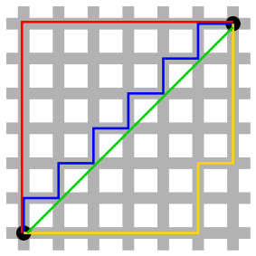

# Isolation Agent Heuristic Analysis

## Overview

The _AlphaBetaPlayer_ isolation agent was played against 7 different adversarial agents, all with varying levels of sophistication ranging from a random agent, to an _AlphaBetaPlayer_ using the `improved_score` heuristic (explained below).

The _AlphaBetaPlayer_ using the `improved_score` is considered the state of the art for this experiment, with the goal of developing a heuristic function that would improve on the state of the art.

The tournament was run for three custom heuristic functions described below, and the performance was compared to that of the `improved_score`, named "AB_Improved".  Each adversarial agent was played 5 times and the average
score over the 10 matches was used to evaluate the performance.

The opponent naming convention in the results presented is the following: `ID_Heurstic`, where _ID_ refers to the _type_ of agent and _Heuristic_ refers to the function used to evaluate each move.

The types of agents are
* Random: an agent making a random move at each step
* MiniMaxPlayer (MM): An agent which implements the MiniMax game tree search algorithm
* AlphaBetaPlayer (AB): An agent which improves on MM by including Alpha-Beta pruning to the it's game tree search algorithm.

Throughout this document, the term _player_ will be loosely used to represent the player we want to win the game, and _opponent_ refers to the player _opponent_ is trying to beat.

## Heuristic Analysis

I recommend picking the **Avoid Edges heuristic** for the AlphaBeta game agent.
This heuristic has the best performance overall, and out performed the Improved heuristic on average score. Furthermore, the Avoid Edges heuristic is about the same computational complexity as the Manhattan score (O(n)), but consistently performed better than or equal to the Manhattan score for all opponents.

Thus the Avoid Edges heuristic is the best choice in terms of overall performance, computational complexity and performance w.r.t all opponents.


### Improved Score

This heuristic was provided to the students through the lecture materials. The heuristic maximizes the number of available moves to the _player_, while minimizing the number of available moves to the _opponent_.

### Custom Heuristic 1: Open Canvas Score

This heuristic evaluates the player position by calculating the number of open spaces in a 2-block wide _canvas_ around the player. Below, the player position is labeled as `p` and the canvas is marked with x's.

The idea behind this heuristic is simply to optimize space around the player to increase the probability of having an available L-shaped move in the future.

```
      0   1   2   3   4   5   6
0  |   |   |   |   |   |   |   |
1  |   | x | x | x | x | x |   |
2  |   | x | x | x | x | x |   |
3  |   | x | x | p | x | x |   |
4  |   | x | x | x | x | x |   |
5  |   | x | x | x | x | x |   |
6  |   |   |   |   |   |   |   |

```

This heuristic is **not recommended**, and is used to compare the performance of other strategies.

### Custom Heuristic 2: Manhattan Distance

The Manhattan distance is the path taken when between two points on a grid based system. In the image below, the red, blue and yellow lines all show the Manhattan distance, which is the sum of the tiles traversed to get from point 1 to point 2. The name comes from the grid like structure of the streets of Manhattan.

<div style="width: 100%; text-align: center">
  
  <p style="font-size: 12px; color: gray;">Manhattan distance depiction, taken from Wikipedia</p>
</div>

For this heuristic, the Manhattan distance from the players position to the center of the board is calculated. The difference between the player and the opponent's Manhattan distance is used as the metric for evaluation, thus steering the player towards the center of the board and optimizing moves that steer the opponent away from the center.

This heuristic is **not recommended**, and is used to compare the performance of other strategies.

### Custom Heuristic 3: Avoid Edges

An alternative, and closely related to the Manhattan distance, this heuristic steers the player away from moves that lead to the edges of the board. The logic behind this is that moves on the edges of the boards have a higher probability of getting stuck.

This heuristic is evaluated by calculating what portion of a player's available moves lie on the game edge. It then minimizes for the that proportion and maximizes opponent's portion of edge moves.

This heuristic **is recommended**, for competitive play as it achieved the best results.

### Results:

```

Match #  Opponent    AB_Improved  CanvasCount   Manhattan   AvoidEdges
                    Won | Lost   Won | Lost   Won | Lost   Won | Lost
1       Random      17  |   3    19  |   1    18  |   2    19  |   1
2       MM_Open     15  |   5    16  |   4    15  |   5    19  |   1
3      MM_Center    18  |   2    15  |   5    18  |   2    18  |   2
4     MM_Improved   15  |   5    16  |   4    15  |   5    11  |   9
5       AB_Open     10  |  10    13  |   7    10  |  10    12  |   8
6      AB_Center    14  |   6     8  |  12    12  |   8    12  |   8
7     AB_Improved   10  |  10     5  |  15     8  |  12     9  |  11
--------------------------------------------------------------------------
        Win Rate:      70.7%        65.7%        68.6%        71.4%
```

From these results we can see that the _AvoidEdges_ heuristic outperforms the _Improved Score_ heuristic with 0.7% over all 70 games, although actually loosing a majority of the game when playing directly against the _Improved Score_  agent.


## Code

Here are the python implementations of the heuristics described above.

#### Improved Score

```python
def improved_score(game, player):
  """
  This is the default evaluation function for the isolation agent

  The "Improved" evaluation function discussed in lecture that outputs a
  score equal to the difference in the number of moves available to the
  two players.
  """
  if game.is_loser(player):
      return float("-inf")

  if game.is_winner(player):
      return float("inf")

  own_moves = len(game.get_legal_moves(player))
  opp_moves = len(game.get_legal_moves(game.get_opponent(player)))
  return float(own_moves - opp_moves)
```

#### Open Canvas score
```python
def open_canvas_score(game, player):
  if game.is_loser(player):
      return float("-inf")

  if game.is_winner(player):
      return float("inf")

  '''
  Get the number of open squares around the players in a 2 square radius
  '''
  own_y, own_x = game.get_player_location(player)
  opp_y, opp_x = game.get_player_location(game.get_opponent(player))
  blank_spaces = game.get_blank_spaces()

  own_canvas_count = 0
  opp_canvas_count = 0
  for bx, by in blank_spaces:
      if (abs(bx - own_x) == player.n and abs(by - own_y) <= player.n) or (
                      abs(by - own_y) == player.n and abs(bx - own_x) <= player.n):
          own_canvas_count += 1

      if (abs(bx - opp_x) == player.n and abs(by - opp_y) <= player.n) or (
                      abs(by - opp_y) == player.n and abs(bx - opp_x) <= player.n):
          opp_canvas_count += 1

  return float(own_canvas_count - opp_canvas_count)
```

#### Manhattan Distance to Center

```python
def manhattan_distance(game, player):
  if game.is_loser(player):
      return float("-inf")

  if game.is_winner(player):
      return float("inf")

  # Center position of board
  center_x, center_y = (game.width / 2), (game.height / 2)

  # Opponent x and y coordinates
  opp_y, opp_x = game.get_player_location(game.get_opponent(player))

  opp_distance = abs(opp_x - center_x) + abs(opp_y - center_y)

  # Player x and y coordinates
  own_y, own_x = game.get_player_location(player)

  own_distance = abs(own_x - center_x) + abs(own_y - center_y)

  return float(opp_distance - own_distance)
```

#### Avoid Edges

```python
def custom_score(game, player):
  # moves available to player and opponent
  own_moves = game.get_legal_moves(player)
  opp_moves = game.get_legal_moves(game.get_opponent(player))

  # losing branch
  if not own_moves:
      return float("-inf")

  # winning branch
  if not opp_moves:
      return float("inf")

  # Count moves along edges of board for player and opponent
  own_moves_edges = [move for move in own_moves if
                     move[0] == 0 or move[0] == game.width or move[1] == 0 or move[1] == game.height]
  opp_moves_edges = [move for move in opp_moves if
                     move[0] == 0 or move[0] == game.width or move[1] == 0 or move[1] == game.height]

  # Minimize the ratio of edge moves for the player and maximize for the opponent
  return len(opp_moves_edges) / len(opp_moves) - len(own_moves_edges) / len(own_moves)
```
